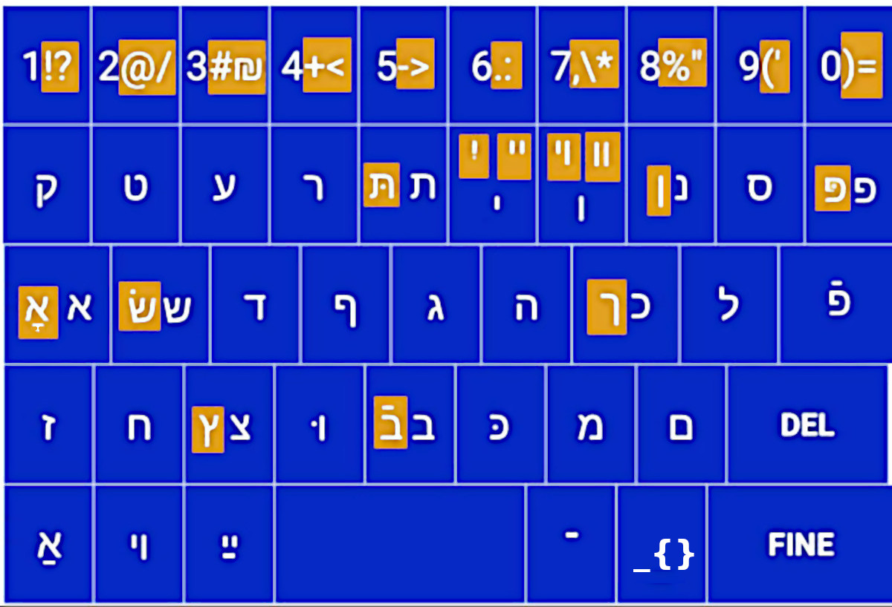

# Yiddish Keyboard (free like beer)

**Normalization Form KD (Compatibility Decomposition)**

New yiddish has some more letters than hebrew. Some other open source keyboards (dec 2018)
did not have these letters. Some non payment `le goog` store app have it ... but not FOSS.
The original `le goog` android has a yiddish layout, but linage OS not.

You can get a signed APK from here (Android 4.1+): [APK](https://raw.githubusercontent.com/no-go/YiddishKeyboard/master/app/release/click.dummer.yidkey.apk)

## Screenshot

## Privacy Policy

### Personal information.

Personal information is data that can be used to uniquely identify or contact a single person. I DO NOT collect, transmit, store or use any personal information while you use this app.

### Non-Personal information.

I DO NOT collect non-personal information like user's behavior:

 -  to solve App problems
 -  to show personalized ads

The google play store collect non-personal information such as the data of install (country and equipment).

### Privacy Questions.

If you have any questions or concerns about my Privacy Policy or data processing, please contact me.

## License

This is free and unencumbered software released into the public domain.

Anyone is free to copy, modify, publish, use, compile, sell, or distribute this software, either in source code form or as a compiled binary, for any purpose, commercial or non-commercial, and by any means.

In jurisdictions that recognize copyright laws, the author or authors of this software dedicate any and all copyright interest in the software to the public domain. We make this dedication for the benefit of the public at large and to the detriment of our heirs and successors. We intend this dedication to be an overt act of relinquishment in perpetuity of all present and future rights to this software under copyright law.

THE SOFTWARE IS PROVIDED "AS IS", WITHOUT WARRANTY OF ANY KIND, EXPRESS OR IMPLIED, INCLUDING BUT NOT LIMITED TO THE WARRANTIES OF MERCHANTABILITY, FITNESS FOR A PARTICULAR PURPOSE AND NONINFRINGEMENT. IN NO EVENT SHALL THE AUTHORS BE LIABLE FOR ANY CLAIM, DAMAGES OR OTHER LIABILITY, WHETHER IN AN ACTION OF CONTRACT, TORT OR OTHERWISE, ARISING FROM, OUT OF OR IN CONNECTION WITH THE SOFTWARE OR THE USE OR OTHER DEALINGS IN THE SOFTWARE.

For more information: http://unlicense.org
